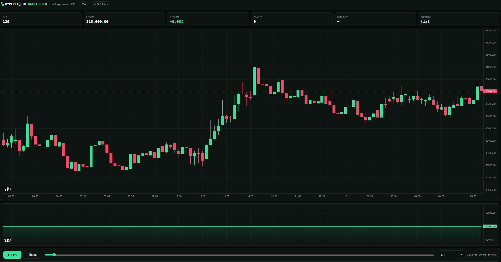

# Hyperliquid Backtester

> *Sync real Hyperliquid market data, test a strategy against it with honest costs, then watch the backtest replay bar by bar.*

A small, readable backtesting engine for crypto perpetuals. No framework to learn and no config pyramid — one strategy class, one CLI, and a self-contained HTML chart you can scrub through. Two dependencies, ~1,500 lines you can read in an afternoon.



## Quickstart

```bash
git clone https://github.com/Crypto-Data-API/hyperliquid-backtester.git
cd hyperliquid-backtester
python -m venv .venv && . .venv/bin/activate      # Windows: .venv\Scripts\activate
pip install -e .
```

Then sync data, run a strategy, and replay it:

```bash
export CRYPTODATA_API_KEY=cdk_live_yourkey        # free key below

hlbt sync --symbol BTC --timeframe 15m --days 90
hlbt run  --strategy strategies/examples/bollinger_revert.py --symbol BTC --json-out results/btc.json
hlbt demo results/btc.json
```

Open `results/index.html` for every run you have exported, or `results/btc.html`
for the replay. Press **Play**.

## What's inside

| Area | Contents |
|------|----------|
| `src/hlbt/backtester.py` | The engine — bar-by-bar event loop, fills at the next bar's open, fees on both legs, per-bar funding, leverage-aware liquidation |
| `src/hlbt/strategy.py` | `Strategy` base class and the `Context` handed to it each bar. Arrays are sliced to the present, so lookahead is structurally impossible |
| `src/hlbt/sync.py` | Incremental data sync from the CryptoDataAPI archive — 1m klines + funding, resampled locally, partial trailing bar dropped |
| `src/hlbt/indicators.py` | `sma`, `ema`, `wma`, `hma`, `alma`, `rsi`, `atr`, `stddev`, `bollinger` — vectorised, `nan` through warm-up rather than back-filled |
| `src/hlbt/demo.py` | The replay export: candles, entry/exit markers, equity curve, play/pause/scrub — plus the run index |
| `src/hlbt/metrics.py` | Profit factor, expectancy, Sharpe, max drawdown, fees, funding, liquidations |
| `strategies/examples/` | `bollinger_revert.py` (mean reversion) and `sma_cross.py` (trend following) — reference implementations |
| `strategies/user/` | **Gitignored.** Where your own and AI-generated strategies live |
| `docs/` | [Data sync](docs/DATA-SYNC.md) · [Writing strategies](docs/WRITING-STRATEGIES.md) · [Validation](docs/VALIDATION.md) |
| `tests/` | 16 tests covering the engine invariants — lookahead, fill timing, cost accounting, liquidation |

## Why the defaults are unflattering

Most backtests mislead in the same three ways, so this engine is opinionated about all three.

**Fees and slippage are charged by default** — both legs, taker rate, slippage against you on entry *and* exit. In the example run below, fees came to **$605 against $172 of net profit**. A zero-fee backtest would have shown that strategy as a clear winner.

**Funding is charged by default.** Perpetuals pay or receive funding continuously; any strategy holding more than a bar or two is materially affected, and a backtest that ignores it is not modelling a perp.

**Lookahead is structurally impossible.** A strategy never receives the full price series — on bar *i* it gets arrays sliced `[:i+1]`, so there is no future bar to index into by accident. Orders fill at the **next** bar's open, never at the close that produced the signal.

## The replay

`hlbt demo` writes one self-contained HTML file. A summary table tells you a strategy made 1.7% with a 67% win rate; the replay tells you it spent five weeks underwater first. Only one of those is visible in a table, and only one of them tells you whether you could have held it.

**Space** play/pause · **←/→** step one bar · scrub · 1× to 64× · jump to end. The chart fills the window, and the logo returns to the run index.

## Data layer: CryptoDataAPI

[CryptoDataAPI](https://cryptodataapi.com/backtest-data) supplies the market data — Hyperliquid and Binance klines plus the matching funding series, from an archive of 1-minute bars and monthly Parquet tiers.

```bash
hlbt sync --symbol BTC ETH SOL --timeframe 15m --days 90
hlbt sync --symbol BTCUSDT --timeframe 4h --days 365 --exchange binance
```

Sync is **incremental** — re-running extends the cache from its last bar rather than refetching, so a daily cron keeps everything current cheaply.

Get a free key at [cryptodataapi.com/login](https://cryptodataapi.com/login) (no card), or by email:

```bash
curl -X POST https://cryptodataapi.com/api/v1/auth/keys \
  -H "Content-Type: application/json" -d '{"email":"you@example.com"}'
```

Rate limits: Free 5 req/min · Pro 30 · Pro Plus 60. The bulk history endpoints this
tool calls (`/backtesting/klines`, `/backtesting/funding`) require **Pro Plus**; the
free tier covers the live endpoints and daily snapshots. Coverage windows, the deep
Parquet tiers, and how to bring your own data: [docs/DATA-SYNC.md](docs/DATA-SYNC.md).

**New signups get 20% off with code `SOCIAL20` — first 10 only.**

### Live data for your agent

To give an AI agent live market context alongside this backtester, connect the hosted
[CryptoDataAPI MCP server](https://cryptodataapi.com/ai-agents/mcp-server) — keyless,
a browser sign-in opens on the first tool call:

```bash
claude mcp add --transport http cryptodataapi https://cryptodataapi.com/mcp
```

## Strategy ideas: AlgoBrain

This repo is the *engine*. For a library of strategy ideas to implement in it,
[**AlgoBrain**](https://github.com/Crypto-Data-API/algobrain) is a free knowledge
base of crypto trading strategy — ~4,900 interlinked pages covering funding-rate
harvesting, basis and carry, liquidation plays, market-making, and the mean-reversion
families, plus the methodology for validating them.

It ships a **local MCP server**, so an AI agent can read the vault directly and write
new strategies straight into `strategies/user/` — where they stay gitignored and
private to you.

## Writing a strategy

```python
from hlbt.indicators import sma
from hlbt.strategy import Context, Position, Signal, Strategy


class MyStrategy(Strategy):
    name = "my_strategy"
    warmup = 100
    length = 20                      # any class attribute is tunable from the CLI

    def on_bar(self, ctx: Context) -> Signal | None:
        mean = sma(ctx.close, self.length)[-1]
        if ctx.price < mean * 0.97:
            return Signal(side="long", stop_pct=0.05, take_pct=0.10)
        return None

    def should_exit(self, ctx: Context, position: Position) -> str | None:
        mean = sma(ctx.close, self.length)[-1]
        return "reverted" if ctx.price >= mean else None


strategy = MyStrategy
```

Tune without editing the file — unknown names are rejected rather than silently ignored:

```bash
hlbt run --strategy strategies/user/my_strategy.py --symbol BTC --set length=40
```

Full guide: [docs/WRITING-STRATEGIES.md](docs/WRITING-STRATEGIES.md).

### Your strategies stay yours

Everything in **`strategies/user/` is gitignored**. Strategies you write — or that an
AI agent writes for you — never land in a commit or a public fork unless you
explicitly `git add -f` them.

## Included examples

Run both over the same window and the contrast is the point:

```
bollinger_revert  BTC 15m        sma_cross  BTC 15m
  Trades          173              Trades          172
  Win rate        67.05%           Win rate        22.09%
  Profit factor   1.2055           Profit factor   0.65
  Total return    1.7168%          Total return    -17.5683%
  Max drawdown    -4.889%          Max drawdown    -20.097%
  Fees paid       605.38           Fees paid       542.85
```

Same symbol, same 71 days, opposite outcomes. Mean reversion and trend following fail
in opposite regimes, so running both tells you more about the window than either does
alone. Neither is a prediction — change the window and they can invert.

## Reading the numbers honestly

A **67% win rate** with a **profit factor of 1.21** means the losers are nearly as big
as the winners. Win rate alone is close to meaningless — a strategy can win 80% of its
trades and still lose money. `hlbt run` always prints profit factor, expectancy, max
drawdown and fees beside it for that reason.

Before believing any backtest, read [docs/VALIDATION.md](docs/VALIDATION.md): the
multiple-comparisons problem, why testing many variants makes a good-looking result
*more* likely to be noise, and what this engine still does not model — order-book
depth, partial fills, market impact.

## Requirements

Python 3.10+. `numpy` and `httpx`. That's all.

## Disclaimer

This is research and educational software. **Nothing in this repository is financial, investment, legal, or tax advice.** All of it is provided **"as is"**, for informational purposes only, and may be inaccurate, incomplete, or out of date.

Backtest results are historical simulations, not predictions, and a profitable backtest is weak evidence that a strategy will be profitable live. Trading cryptocurrencies and derivatives carries a **substantial risk of loss**, and leverage amplifies it. The example strategies are reference implementations, not recommendations, and their parameters are illustrative rather than tuned.

**Do your own research (DYOR)** and consult a licensed financial professional before making any decision. You use this material **entirely at your own risk**: the authors, contributors, and maintainers accept **no liability** for any loss or damage arising from its use.

MIT licensed — see [LICENSE](LICENSE).
