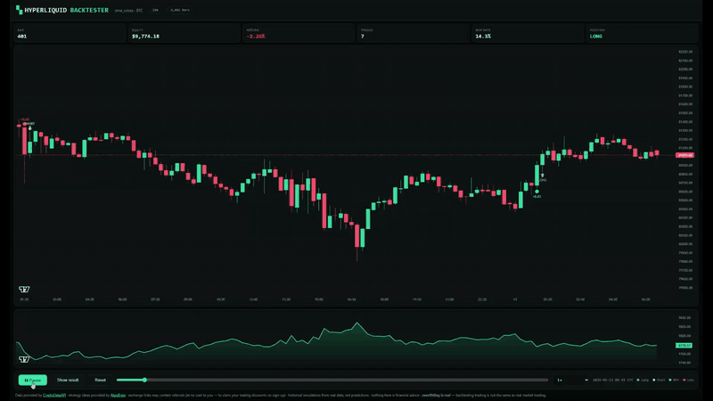

# Hyperliquid Backtester

> *Backtest crypto perpetual strategies against real Hyperliquid market data, on your machine, in three commands.*

Here is the kind of thing it tells you that a normal backtest hides. The mean-reversion example in this repo returns **+1.72%** over 71 days — and to earn that **$172 of profit it paid $605 in fees.** Costs ate **78% of the gross**. Switch fees off, as most backtests quietly do, and the same strategy looks like a runaway winner.

That is the entire design goal: a number you can act on, or a number you can throw away — but never a number that flatters you.

[](attachments/hyperliquid-backtester-demo.mp4)

<sub>Replaying `sma_cross` on BTC 15m — click for full resolution. Blue arrows are longs, yellow are shorts; green dots closed in profit, red at a loss.</sub>

## Three things it does that most backtesters don't

**Lookahead is impossible, not merely discouraged.** Your strategy is never handed the full price series. On bar *i* it receives arrays sliced `[:i+1]` — there is no future bar to index into by accident, and no discipline required to avoid it. Orders fill at the **next** bar's open, never at the close that produced the signal. Both properties are locked down by tests.

**Costs are on by default and hurt.** Taker fees on both legs, slippage against you entering *and* exiting, funding charged per bar, and leverage-aware liquidation checked against each bar's adverse extreme. When a single bar spans both your stop and your target, the **stop wins** — because OHLC cannot tell you which came first, and guessing in your own favour is how backtests start lying.

**You can watch it happen.** `hlbt demo` exports a self-contained HTML replay: candles, entry and exit markers, a live equity curve, and a play button. A summary table says *"+1.72%, 67% win rate"* and sounds pleasant. The replay shows you the **24 unbroken days underwater** it took to get there — that strategy sat below its starting equity for **41% of the run**. One of those two views tells you whether you'd have actually held on.

## Two strategies, same market, same 71 days, opposite conclusions

| | `bollinger_revert` | `sma_cross` |
|---|---|---|
| Win rate | **67.05%** | 22.09% |
| Risk:reward | 0.59 | **2.29** |
| Profit factor | **1.21** | 0.65 |
| Expectancy / trade | **+$2.70** | −$8.58 |
| **Return** | **+1.72%** | **−17.57%** |

Pick your strategy on win rate and you take the first. Pick it on risk:reward and you take
the second — which loses 17.6%. The reversion system wins constantly with *terrible*
reward-to-risk; the trend system risks well and is simply wrong four times out of five.

No single metric survives that. So `hlbt run` prints profit factor, expectancy, max
drawdown and fees beside win rate every time, and the run index sorts on any of them.

## Quickstart

```bash
git clone https://github.com/Crypto-Data-API/hyperliquid-backtester.git
cd hyperliquid-backtester
python -m venv .venv && . .venv/bin/activate      # Windows: .venv\Scripts\activate
pip install -e .
```

Then sync data, run a strategy, and replay it:

```bash
export CRYPTODATA_API_KEY=cdk_live_yourkey        # free key below

hlbt sync --symbol BTC --timeframe 15m --days 90
hlbt run  --strategy strategies/examples/bollinger_revert.py --symbol BTC --json-out results/btc.json
hlbt demo results/btc.json
```

Open `results/index.html` for every run you have exported, or `results/btc.html`
for the replay. Press **Play**.

## What's inside

| Area | Contents |
|------|----------|
| `src/hlbt/backtester.py` | The engine — bar-by-bar event loop, fills at the next bar's open, fees on both legs, per-bar funding, leverage-aware liquidation |
| `src/hlbt/strategy.py` | `Strategy` base class and the `Context` handed to it each bar. Arrays are sliced to the present, so lookahead is structurally impossible |
| `src/hlbt/sync.py` | Incremental data sync from the CryptoDataAPI archive — 1m klines + funding, resampled locally, partial trailing bar dropped |
| `src/hlbt/indicators.py` | `sma`, `ema`, `wma`, `hma`, `alma`, `rsi`, `atr`, `stddev`, `bollinger` — vectorised, `nan` through warm-up rather than back-filled |
| `src/hlbt/demo.py` | The replay export: candles, entry/exit markers, equity curve, play/pause/scrub — plus the run index |
| `src/hlbt/metrics.py` | Profit factor, expectancy, Sharpe, max drawdown, fees, funding, liquidations |
| `strategies/examples/` | `bollinger_revert.py` (mean reversion) and `sma_cross.py` (trend following) — reference implementations |
| `strategies/user/` | **Gitignored.** Where your own and AI-generated strategies live |
| `docs/` | [Data sync](docs/DATA-SYNC.md) · [Writing strategies](docs/WRITING-STRATEGIES.md) · [Validation](docs/VALIDATION.md) |
| `tests/` | 16 tests covering the engine invariants — lookahead, fill timing, cost accounting, liquidation |

## The replay

**Space** play/pause · **←/→** step one bar · scrub · **0.25× to 64×** · jump to end. Entries
are blue for long and yellow for short; exits are green for a win and red for a loss.

It opens at 0.5× — slow enough to watch a position open, sit, and resolve. Wind it up to
16× or 64× to skim a long run, or jump straight to the finished result.

The run index sorts on any column, filters by strategy, and draws an equity sparkline per
run — so a losing streak is visible before you open anything.

## Data layer: CryptoDataAPI

[CryptoDataAPI](https://cryptodataapi.com/backtest-data) supplies the market data — Hyperliquid and Binance klines plus the matching funding series, from an archive of 1-minute bars and monthly Parquet tiers.

```bash
hlbt sync --symbol BTC ETH SOL --timeframe 15m --days 90
hlbt sync --symbol BTCUSDT --timeframe 4h --days 365 --exchange binance
```

Sync is **incremental** — re-running extends the cache from its last bar rather than refetching, so a daily cron keeps everything current cheaply.

Get a free key at [cryptodataapi.com/login](https://cryptodataapi.com/login) (no card), or by email:

```bash
curl -X POST https://cryptodataapi.com/api/v1/auth/keys \
  -H "Content-Type: application/json" -d '{"email":"you@example.com"}'
```

Rate limits: Free 5 req/min · Pro 30 · Pro Plus 60. The bulk history endpoints this
tool calls (`/backtesting/klines`, `/backtesting/funding`) require **Pro Plus**; the
free tier covers the live endpoints and daily snapshots. Coverage windows, the deep
Parquet tiers, and how to bring your own data: [docs/DATA-SYNC.md](docs/DATA-SYNC.md).

**New signups get 20% off with code `SOCIAL20` — first 10 only.**

### Live data for your agent

To give an AI agent live market context alongside this backtester, connect the hosted
[CryptoDataAPI MCP server](https://cryptodataapi.com/ai-agents/mcp-server) — keyless,
a browser sign-in opens on the first tool call:

```bash
claude mcp add --transport http cryptodataapi https://cryptodataapi.com/mcp
```

## Strategy ideas: AlgoBrain

This repo is the *engine*. For a library of strategy ideas to implement in it,
[**AlgoBrain**](https://github.com/Crypto-Data-API/algobrain) is a free knowledge
base of crypto trading strategy — ~4,900 interlinked pages covering funding-rate
harvesting, basis and carry, liquidation plays, market-making, and the mean-reversion
families, plus the methodology for validating them.

It ships a **local MCP server**, so an AI agent can read the vault directly and write
new strategies straight into `strategies/user/` — where they stay gitignored and
private to you.

## Writing a strategy

```python
from hlbt.indicators import sma
from hlbt.strategy import Context, Position, Signal, Strategy


class MyStrategy(Strategy):
    name = "my_strategy"
    warmup = 100
    length = 20                      # any class attribute is tunable from the CLI

    def on_bar(self, ctx: Context) -> Signal | None:
        mean = sma(ctx.close, self.length)[-1]
        if ctx.price < mean * 0.97:
            return Signal(side="long", stop_pct=0.05, take_pct=0.10)
        return None

    def should_exit(self, ctx: Context, position: Position) -> str | None:
        mean = sma(ctx.close, self.length)[-1]
        return "reverted" if ctx.price >= mean else None


strategy = MyStrategy
```

Tune without editing the file — unknown names are rejected rather than silently ignored:

```bash
hlbt run --strategy strategies/user/my_strategy.py --symbol BTC --set length=40
```

Full guide: [docs/WRITING-STRATEGIES.md](docs/WRITING-STRATEGIES.md).

### Your strategies stay yours

Everything in **`strategies/user/` is gitignored**. Strategies you write — or that an
AI agent writes for you — never land in a commit or a public fork unless you
explicitly `git add -f` them.

## Before you believe any of it

Two example strategies ship with the repo — `bollinger_revert` (mean reversion) and
`sma_cross` (trend following). They fail in opposite regimes, so running both tells you
more about the *window* than either tells you about itself. Neither is a prediction:
change the dates and the winner can invert.

That caveat is the point. Read [docs/VALIDATION.md](docs/VALIDATION.md) before trusting
any result you get here — it covers the
multiple-comparisons problem, why testing many variants makes a good-looking result
*more* likely to be noise, and what this engine still does not model — order-book
depth, partial fills, market impact.

## Requirements

Python 3.10+. `numpy` and `httpx`. That's all.

## Disclaimer

This is research and educational software. **Nothing in this repository is financial, investment, legal, or tax advice.** All of it is provided **"as is"**, for informational purposes only, and may be inaccurate, incomplete, or out of date.

Backtest results are historical simulations, not predictions, and a profitable backtest is weak evidence that a strategy will be profitable live. Trading cryptocurrencies and derivatives carries a **substantial risk of loss**, and leverage amplifies it. The example strategies are reference implementations, not recommendations, and their parameters are illustrative rather than tuned.

**Do your own research (DYOR)** and consult a licensed financial professional before making any decision. You use this material **entirely at your own risk**: the authors, contributors, and maintainers accept **no liability** for any loss or damage arising from its use.

MIT licensed — see [LICENSE](LICENSE).
